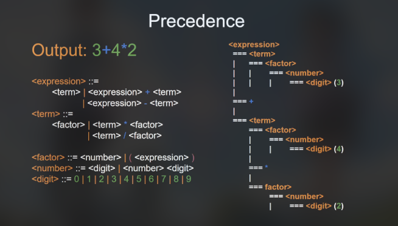
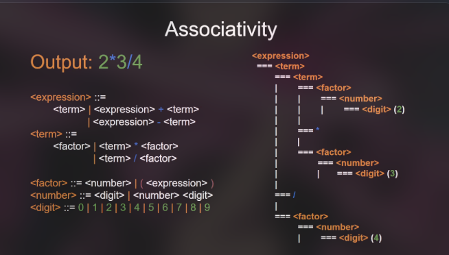

this would not be possible with the help of ai for brainstorming this problem

the code structure will look like this

1. on top will be the lexer
2. the parser
3. then the ast generator
4. output

the flow
                 INPUT
                   │
                   v
                 LEXER
                   │
                   v
              TOKEN STREAM
                   │
                   v
        RECURSIVE DESCENT PARSER
                   │
                   v
                  AST
                   │
                   v
              AST TRAVERSAL
                   │
                   v
                RESULT

legend
LPAREN = LEFT PARENTHESIS hindi "El Paren" LOL
RPAREN = RIGHT PARENTHESIS hindi "Ar Paren" LOL

the lexer ppseudo code:
CLASS Lexer:
    CONSTRUCTOR(sourceText):
        this.input = sourceText
        this.index = 0
        this.rules = [
            { type: "NUMBER", regex: /^[0-9]+(\.[0-9]+)?/ },
            { type: "ADD",    regex: /^\+/ },
            { type: "SUB",    regex: /^-/ },
            { type: "MULT",   regex: /^\*/ },
            { type: "DIV",    regex: /^\// },
            { type: "LPAREN", regex: /^\(/ },
            { type: "RPAREN", regex: /^\)/ },
            { type: "SPACE",  regex: /^\s+/ }
        ]

    METHOD tokenize():
        const tokens = []

        WHILE this.index < this.input.length:
            const remaining = this.input.slice(this.index)
            let matched = false

            FOR const rule OF this.rules:
                const match = remaining.match(rule.regex)

                IF match is not null:
                    const value = match[0]

                    IF rule.type !== "SPACE":
                        tokens.push({ type: rule.type, value: value })

                    this.index += value.length
                    matched = true
                    BREAK loop

            IF matched === false:
                THROW new Error(`Unexpected character: ${remaining[0]}`)

        tokens.push({ type: "EOF", value: null })
        RETURN tokens

CLASS Parser:
    CONSTRUCTOR(tokens):
        this.tokens = tokens
        this.index = 0

    METHOD peek():
        RETURN this.tokens[this.index]

    METHOD consume(expectedType):
        const currentToken = this.peek()

        IF currentToken.type === expectedType:
            this.index++
            RETURN currentToken
        ELSE:
            THROW new Error(`Expected token ${expectedType}, but got ${currentToken.type}`)

    // Low precedence: Addition & Subtraction
    METHOD parseExpression():
        let leftNode = this.parseTerm()

        WHILE this.peek().type === "ADD" OR this.peek().type === "SUB":
            const operatorToken = this.consume(this.peek().type)
            const rightNode = this.parseTerm()

            leftNode = {
                type: "BinaryExpression",
                operator: operatorToken.value,
                left: leftNode,
                right: rightNode
            }

        RETURN leftNode

    // Medium precedence: Multiplication & Division
    METHOD parseTerm():
        let leftNode = this.parseFactor()

        WHILE this.peek().type === "MULT" OR this.peek().type === "DIV":
            const operatorToken = this.consume(this.peek().type)
            const rightNode = this.parseFactor()

            leftNode = {
                type: "BinaryExpression",
                operator: operatorToken.value,
                left: leftNode,
                right: rightNode
            }

        RETURN leftNode

    // High precedence: Numbers & Grouped Parentheses
    METHOD parseFactor():
        const currentToken = this.peek()

        IF currentToken.type === "NUMBER":
            this.consume("NUMBER")
            RETURN {
                type: "NumericLiteral",
                value: Number(currentToken.value)
            }

        IF currentToken.type === "LPAREN":
            this.consume("LPAREN")
            const insideNode = this.parseExpression()
            this.consume("RPAREN")
            RETURN insideNode

        THROW new Error(`Unexpected token inside factor: ${currentToken.type}`)

    METHOD parse():
        RETURN this.parseExpression()

FUNCTION evaluateAST(node):
    // Base Case: Leaf node containing a raw number
    IF node.type === "NumericLiteral":
        RETURN node.value

    // Recursive Step: Operator node
    IF node.type === "BinaryExpression":
        const leftValue = evaluateAST(node.left)
        const rightValue = evaluateAST(node.right)

        SWITCH node.operator:
            CASE "+": RETURN leftValue + rightValue
            CASE "-": RETURN leftValue - rightValue
            CASE "*": RETURN leftValue * rightValue
            CASE "/":
                IF rightValue === 0:
                    THROW new Error("Division by zero")
                RETURN leftValue / rightValue

    THROW new Error(`Unknown node type: ${node.type}`)

output
const input = "5 + (3 * 2)"

// 1. Tokenize
const lexer = new Lexer(input)
const tokens = lexer.tokenize()
console.log(tokens)

// 2. Parse to AST
const parser = new Parser(tokens)
const ast = parser.parse()
console.log(JSON.stringify(ast, null, 2))

// 3. Evaluate
const result = evaluateAST(ast)
console.log("Result:", result)

sources i used:
for knowing the regexp in js
- https://www.freecodecamp.org/news/regex-in-javascript/ 

for the Grammar Stratification which help me understand how to solve the ambiguity problem
- https://arman-dev-blog.hashnode.dev/precedence-and-associativity-in-grammar-rules#heading-precedence-and-associativityhttpsarman-dev-bloghashnodedevcreating-tuffscript \

errors encountered
error 1
ramming-Languages-Labs/lab1.js:69
            tokens.push({type = tokentype.type, value: value})
                         ^^^^^^^^^^^^^^^^^^^^^

SyntaxError: Invalid shorthand property initializer
    at wrapSafe (node:internal/modules/cjs/loader:1713:18)
    at Module._compile (node:internal/modules/cjs/loader:1755:20)
    at Module._extensions..js (node:internal/modules/cjs/loader:1913:10)
    at Module.load (node:internal/modules/cjs/loader:1505:32)
    at Module._load (node:internal/modules/cjs/loader:1309:12)
    at wrapModuleLoad (node:internal/modules/cjs/loader:254:19)
    at Function.executeUserEntryPoint [as runMain] (node:internal/modules/run_main:171:5)
    at node:internal/main/run_main_module:36:49

REason: i used an equal sign instead of ":"

hardest error encountered
/home/laurencejhonadominguez/Documents/Programming Languages/labs/Programming-Languages-Labs/lab1.js:142
    if (this.sirip().type === "NUMBER") {
                    ^

TypeError: Cannot read properties of undefined (reading 'type')
    at Parser.Factor (/home/laurencejhonadominguez/Documents/Programming Languages/labs/Programming-Languages-Labs/lab1.js:142:21)
    at Parser.Term (/home/laurencejhonadominguez/Documents/Programming Languages/labs/Programming-Languages-Labs/lab1.js:125:26)
    at Parser.Expresyon (/home/laurencejhonadominguez/Documents/Programming Languages/labs/Programming-Languages-Labs/lab1.js:109:25)
    at Parser.Parse (/home/laurencejhonadominguez/Documents/Programming Languages/labs/Programming-Languages-Labs/lab1.js:157:22)
    at Object.<anonymous> (/home/laurencejhonadominguez/Documents/Programming Languages/labs/Programming-Languages-Labs/lab1.js:195:20)
    at Module._compile (node:internal/modules/cjs/loader:1781:14)
    at Module._extensions..js (node:internal/modules/cjs/loader:1913:10)
    at Module.load (node:internal/modules/cjs/loader:1505:32)
    at Module._load (node:internal/modules/cjs/loader:1309:12)
    at wrapModuleLoad (node:internal/modules/cjs/loader:254:19)

reason on line 63 i accidentally typed lenght instead of length, this returns an empty list therefor the parser does not know what type is being passed.

error 3
[ Token { type: 'NUMBER', value: '5' } ]
/home/laurencejhonadominguez/Documents/Programming Languages/labs/Programming-Languages-Labs/lab1.js:126
    while (this.sirip().type === "MULT" || this.sirip().type === "DIV") {
                       ^

TypeError: Cannot read properties of undefined (reading 'type')
    at Parser.Term (/home/laurencejhonadominguez/Documents/Programming Languages/labs/Programming-Languages-Labs/lab1.js:126:24)
    at Parser.Expresyon (/home/laurencejhonadominguez/Documents/Programming Languages/labs/Programming-Languages-Labs/lab1.js:109:25)
    at Parser.Parse (/home/laurencejhonadominguez/Documents/Programming Languages/labs/Programming-Languages-Labs/lab1.js:157:22)
    at Object.<anonymous> (/home/laurencejhonadominguez/Documents/Programming Languages/labs/Programming-Languages-Labs/lab1.js:195:20)
    at Module._compile (node:internal/modules/cjs/loader:1781:14)
    at Module._extensions..js (node:internal/modules/cjs/loader:1913:10)
    at Module.load (node:internal/modules/cjs/loader:1505:32)
    at Module._load (node:internal/modules/cjs/loader:1309:12)
    at wrapModuleLoad (node:internal/modules/cjs/loader:254:19)
    at Function.executeUserEntryPoint [as runMain] (node:internal/modules/run_main:171:5)

Node.js v22.23.1
Failed running 'lab1.js'. Waiting for file changes before restarting...

reason :
1. the               if (matched == false) {
          throw new Error("EOF");
        }
    is inside the for loop instead of outside

2. the missing 
 tokens.push(new Token("EOF", null));
 without it, this will throw the same error because it keeps passing unwanted values

 the yey pero ney moment:

 first output:
 Restarting 'lab1.js'
[
  Token { type: 'NUMBER', value: '5' },
  Token { type: 'EOF', value: null }
]
{
  "type": "NumericLiteral",
  "value": 5
}
Result: 5

the input: 5 + 4 * 8

expected 
{
  "type": "BinaryExpression",
  "operator": "+",
  "left": {
    "type": "NumericLiteral",
    "value": 5
  },
  "right": {
    "type": "BinaryExpression",
    "operator": "*",
    "left": {
      "type": "NumericLiteral",
      "value": 4
    },
    "right": {
      "type": "NumericLiteral",
      "value": 8
    }
  }
}

the culprit: this.index = this.index + value.lenght; another typo instead of length

test cases
test 1 "((5 + 3) * (2 - 1))" output:
Restarting 'lab1.js'
[
  Token { type: 'LPAREN', value: '(' },
  Token { type: 'LPAREN', value: '(' },
  Token { type: 'NUMBER', value: '5' },
  Token { type: 'ADD', value: '+' },
  Token { type: 'NUMBER', value: '3' },
  Token { type: 'RPAREN', value: ')' },
  Token { type: 'MULT', value: '*' },
  Token { type: 'LPAREN', value: '(' },
  Token { type: 'NUMBER', value: '2' },
  Token { type: 'SUB', value: '-' },
  Token { type: 'NUMBER', value: '1' },
  Token { type: 'RPAREN', value: ')' },
  Token { type: 'RPAREN', value: ')' },
  Token { type: 'EOF', value: null }
]
{
  "type": "BinaryExpression",
  "operator": "*",
  "left": {
    "type": "BinaryExpression",
    "operator": "+",
    "left": {
      "type": "NumericLiteral",
      "value": 5
    },
    "right": {
      "type": "NumericLiteral",
      "value": 3
    }
  },
  "right": {
    "type": "BinaryExpression",
    "operator": "-",
    "left": {
      "type": "NumericLiteral",
      "value": 2
    },
    "right": {
      "type": "NumericLiteral",
      "value": 1
    }
  }
}
Result: 8

test 2 : 100 / 2 / 2
Restarting 'lab1.js'
[
  Token { type: 'NUMBER', value: '100' },
  Token { type: 'DIV', value: '/' },
  Token { type: 'NUMBER', value: '2' },
  Token { type: 'DIV', value: '/' },
  Token { type: 'NUMBER', value: '2' },
  Token { type: 'EOF', value: null }
]
{
  "type": "BinaryExpression",
  "operator": "/",
  "left": {
    "type": "BinaryExpression",
    "operator": "/",
    "left": {
      "type": "NumericLiteral",
      "value": 100
    },
    "right": {
      "type": "NumericLiteral",
      "value": 2
    }
  },
  "right": {
    "type": "NumericLiteral",
    "value": 2
  }
}
Result: 25